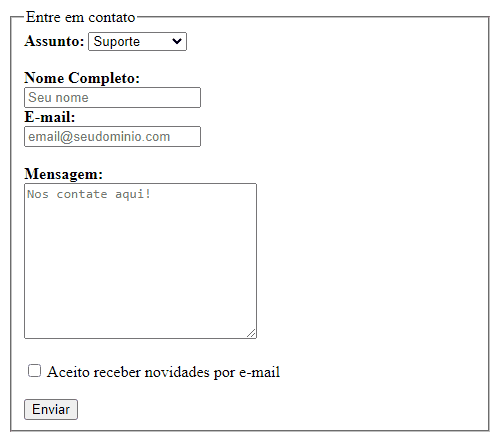

# Html-Form

> A project to test knowledge about forms in HTML. In this simple projects I applied the main functions of a form, at the moment it is not linked to anything but the concept is very important.
